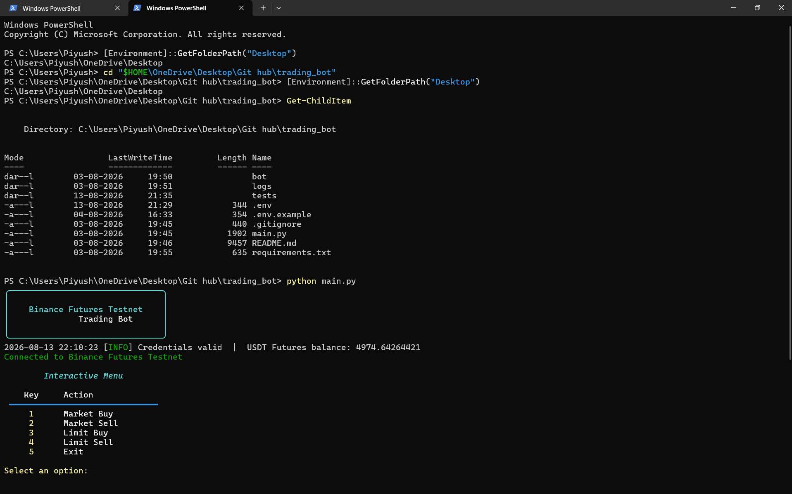
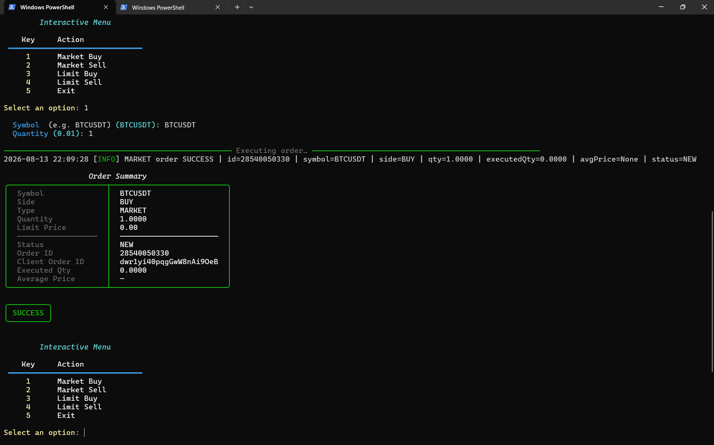
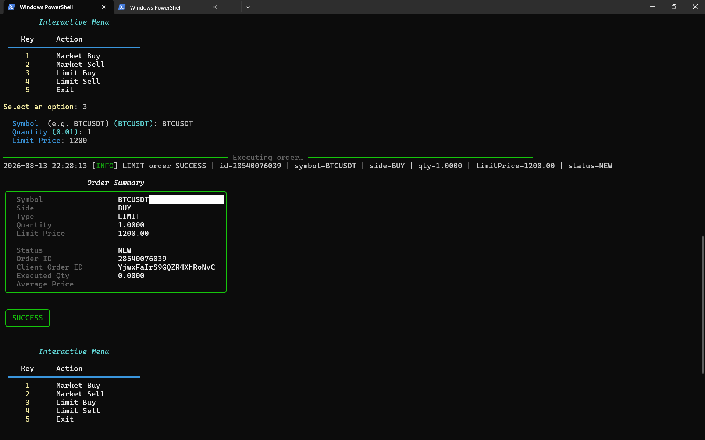

# 🤖 Binance Futures Trading Bot

A modular Python-based trading bot designed for the **Binance Futures Testnet/Demo environment**. The application allows users to place **Market** and **Limit** BUY/SELL orders through both a command-line interface and an interactive terminal menu.

The project focuses on API integration, secure credential management, input validation, structured logging, error handling, and reusable Python architecture.

---

## ✨ Features

* 📈 **Market Orders** — Supports BUY and SELL market orders
* 📊 **Limit Orders** — Supports BUY and SELL limit orders
* 🖥️ **Interactive CLI Menu** — Simple terminal-based interface
* ⚙️ **Command-Line Commands** — Direct order placement through CLI arguments
* 🔐 **Secure API Authentication** — Credentials loaded through environment variables
* ✅ **Input Validation** — Validates symbol, side, quantity, and price
* 📝 **Structured Logging** — Records application activity, API responses, and errors
* 🎨 **Rich Console Output** — Clean tables, panels, and status messages
* 🛡️ **Error Handling** — Handles API, network, timeout, validation, and unexpected errors
* 🧩 **Modular Architecture** — Separate modules for API, orders, validation, configuration, and logging

---

## 🛠️ Tech Stack

* **Python 3.x**
* **Binance Futures API**
* **python-binance**
* **Typer**
* **Rich**
* **python-dotenv**
* **Logging**
* **Git & GitHub**

---

## 📂 Project Structure

```text
Trading_Bot/
│
├── bot/
│   ├── __init__.py
│   ├── api.py
│   ├── client.py
│   ├── config.py
│   ├── logging_config.py
│   ├── orders.py
│   └── validators.py
│
├── tests/
│   └── test_client.py
│
├── screenshots/
│   ├── bot-menu.png
│   ├── market-order.png
│   └── limit-order.png
│
├── .env.example
├── .gitignore
├── README.md
├── requirements.txt
└── main.py
```

> `logs/trading.log` is generated automatically when the application runs and should not be committed to the repository.

---

## 📦 Installation

### 1. Clone the repository

```bash
git clone https://github.com/piyushlahoti-ai/Trading_Bot.git
cd Trading_Bot
```

### 2. Create a virtual environment

#### Windows

```bash
python -m venv .venv
.venv\Scripts\activate
```

#### macOS / Linux

```bash
python3 -m venv .venv
source .venv/bin/activate
```

### 3. Install dependencies

```bash
pip install -r requirements.txt
```

---

## 🔐 API Configuration

Create a `.env` file in the project root based on `.env.example`.

```env
BINANCE_API_KEY=your_api_key_here
BINANCE_API_SECRET=your_api_secret_here
```

The application loads these credentials using `python-dotenv`.

### ⚠️ Security

**Never upload your `.env` file or API credentials to GitHub.**

The `.env` file should remain local and should be included in `.gitignore`.

Only `.env.example` should be committed to the repository.

---

## 🚀 Usage

### Interactive Menu

Run:

```bash
python main.py
```

The bot starts with an interactive menu:

```text
╭───────────────────────────────╮
│                               │
│    Binance Futures Trading    │
│              Bot              │
│                               │
╰───────────────────────────────╯

Interactive Menu

1. Market Buy
2. Market Sell
3. Limit Buy
4. Limit Sell
5. Exit
```

---

## 📈 Market Orders

### Market BUY

```bash
python main.py market --symbol BTCUSDT --side BUY --quantity 1
```

### Market SELL

```bash
python main.py market --symbol BTCUSDT --side SELL --quantity 1
```

The bot displays an order summary containing available information such as:

* Symbol
* Side
* Order type
* Quantity
* Order ID
* Status
* Executed quantity
* Average price

---

## 📊 Limit Orders

### Limit BUY

```bash
python main.py limit --symbol BTCUSDT --side BUY --quantity 1 --price 100000
```

### Limit SELL

```bash
python main.py limit --symbol BTCUSDT --side SELL --quantity 1 --price 120000
```

For LIMIT orders, the price must be provided and must be greater than zero.

---

## 🆘 CLI Help

View available commands:

```bash
python main.py --help
```

View Market order options:

```bash
python main.py market --help
```

View Limit order options:

```bash
python main.py limit --help
```

---

## ✅ Input Validation

The application validates user input before submitting orders.

| Parameter  | Validation                 |
| ---------- | -------------------------- |
| `symbol`   | Must be a non-empty symbol |
| `side`     | Must be `BUY` or `SELL`    |
| `quantity` | Must be greater than `0`   |
| `price`    | Required for LIMIT orders  |
| `price`    | Must be greater than `0`   |
| Order Type | MARKET or LIMIT            |

Invalid input results in a user-friendly error message instead of an unhandled application crash.

---

## 📝 Logging

The application automatically creates a runtime log file:

```text
logs/trading.log
```

The logging system records information such as:

* Timestamp
* Log level
* Order requests
* API responses
* Errors
* Exceptions
* Debug information

The log directory is excluded from the public repository.

---

## 🛡️ Error Handling

The application handles several common failure scenarios:

* Missing environment variables
* Invalid API credentials
* Binance API errors
* Network failures
* Request timeouts
* Invalid user input
* Unexpected exceptions

Errors are logged and presented through user-friendly console messages.

---

## 🧪 Testing

The project includes tests for important application components, including:

* Module imports
* Input validation
* Order result handling
* API response parsing
* Error handling
* Logging configuration

The application was also manually tested through the CLI using Market and Limit order workflows in the simulated trading environment.

---

## 🖼️ Screenshots

### 🔌 Bot Startup & Interactive Menu



### 📈 Market Order



### 📊 Limit Order



---

## 🚀 Future Improvements

Possible future improvements include:

* Open positions viewer
* Order cancellation by Order ID
* Order history
* WebSocket-based live price updates
* Stop-Loss / Take-Profit support
* Additional order types
* Docker support
* Telegram notifications
* Expanded automated test coverage

---

## ⚠️ Disclaimer

This project is intended for **educational and development purposes** and uses a simulated Binance Futures trading environment.

Do not use real trading credentials with this project without performing an appropriate security review and testing the implementation thoroughly.

---

## 👨‍💻 Author

**Piyush Lahoti**

* GitHub: https://github.com/piyushlahoti-ai
* LinkedIn: https://linkedin.com/in/piyush-lahoti-a1a373275

---

## 📄 License

This project is licensed under the **MIT License**.
